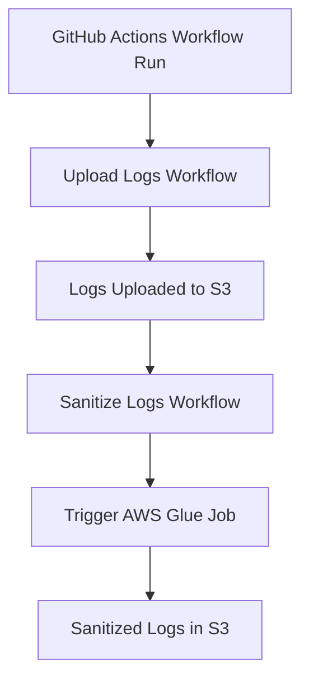

# Log Sanitization Process

This document describes the log sanitization process implemented for the First Order project. The process involves collecting GitHub Actions workflow logs, uploading them to S3, and then sanitizing them using an AWS Glue job.

## Overview

The log sanitization process consists of three main components:

1. **GitHub Actions Workflow for Log Collection**: Collects logs from GitHub Actions workflows and uploads them to S3.
2. **GitHub Actions Workflow for Triggering Sanitization**: Triggers the AWS Glue job to sanitize the logs.
3. **AWS Glue Job for Log Sanitization**: Processes the logs in S3, removing invalid control characters and ensuring valid JSON format.

## Workflow



### 1. Log Collection

The `upload-logs.yaml` workflow is responsible for:

- Collecting logs from GitHub Actions workflows
- Formatting them for analysis
- Uploading them to S3 in the `log-analysis/workflow-logs-for-llm/` prefix

This workflow can be triggered:
- Automatically after a specified workflow completes
- Manually via workflow dispatch

### 2. Log Sanitization Trigger

The `sanitize-logs.yaml` workflow is responsible for:

- Triggering the AWS Glue job to sanitize the logs
- Monitoring the job execution
- Reporting on the job status and metrics

This workflow can be triggered:
- Automatically after the log collection workflow completes
- Manually via workflow dispatch with customizable parameters

### 3. Log Sanitization Process

The AWS Glue job (`first-order-log-sanitizer`) performs the following steps:

1. Lists all `logs.json` files in the specified S3 input prefix
2. For each file:
   - Reads the file content
   - Removes invalid control characters
   - Validates the JSON structure
   - Writes the sanitized content to the output prefix
3. Provides statistics on processed files

## Configuration

### GitHub Actions Workflows

#### Upload Logs Workflow

File: `.github/workflows/upload-logs.yaml`

Parameters (when triggered manually):
- `fetch_all`: Whether to fetch logs from all previous runs
- `run_id`: Run ID of the workflow to download logs from
- `workflow_name`: Name of the workflow to download logs from
- `max_runs`: Maximum number of runs to fetch when fetch_all is true

#### Sanitize Logs Workflow

File: `.github/workflows/sanitize-logs.yaml`

Parameters (when triggered manually):
- `bucket_name`: S3 bucket name (default: first-order-application-logs)
- `input_prefix`: S3 input prefix (default: log-analysis/workflow-logs-for-llm/)
- `output_prefix`: S3 output prefix (default: log-analysis-sanitized/)

### AWS Glue Job

The AWS Glue job is defined in Terraform:

File: `terraform/glue_job.tf`

Parameters:
- `bucket_name`: S3 bucket name
- `input_prefix`: S3 input prefix for raw logs
- `output_prefix`: S3 output prefix for sanitized logs

## Monitoring

The log sanitization process can be monitored through:

1. **GitHub Actions Workflow Runs**: Check the status and logs of the workflow runs in the GitHub Actions tab.
2. **AWS Glue Job Runs**: Monitor the Glue job execution in the AWS Glue console.
3. **CloudWatch Dashboard**: View metrics and logs in the CloudWatch dashboard (`first-order-log-sanitization`).

## Troubleshooting

### Common Issues

1. **Missing Permissions**: Ensure the GitHub Actions workflow has the necessary permissions to access AWS resources.
2. **Invalid JSON**: If the logs contain severely malformed JSON, the sanitization process might fail. Check the Glue job logs for details.
3. **S3 Access Issues**: Verify that the Glue job has the correct IAM permissions to access the S3 bucket.

### Logs

- **GitHub Actions Workflow Logs**: Available in the GitHub Actions tab.
- **AWS Glue Job Logs**: Available in CloudWatch Logs under the `/aws-glue/jobs/output` log group.
- **CloudWatch Metrics**: Available in the CloudWatch dashboard.

## Manual Execution

### Triggering the Log Collection Workflow

```bash
gh workflow run "Upload Workflow Logs to S3 for LLM Analysis" \
  --field fetch_all=false \
  --field run_id=12345678 \
  --field workflow_name="Terraform Deploy AWS Infrastructure" \
  --field max_runs=10
```

### Triggering the Log Sanitization Workflow

```bash
gh workflow run "Sanitize Logs in S3" \
  --field bucket_name=first-order-application-logs \
  --field input_prefix=log-analysis/workflow-logs-for-llm/ \
  --field output_prefix=log-analysis-sanitized/
```

### Running the Glue Job Directly

```bash
aws glue start-job-run \
  --job-name first-order-log-sanitizer \
  --arguments \
    "--bucket_name=first-order-application-logs" \
    "--input_prefix=log-analysis/workflow-logs-for-llm/" \
    "--output_prefix=log-analysis-sanitized/"
